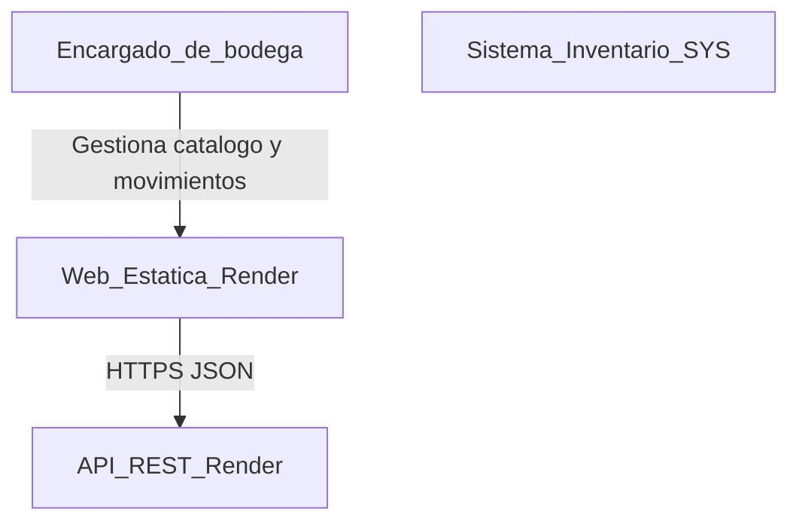
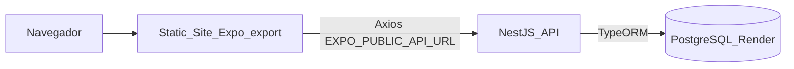
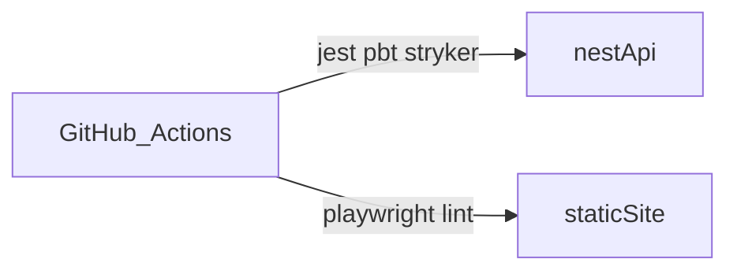

# Diagramas C4 — Inventario SYS

## Nivel 1 — Contexto

## Nivel 2 — Contenedores

## URLs de producción

| Contenedor | URL |
|------------|-----|
| Web | https://proyecto-inventario-8r82.onrender.com |
| API | https://inventario-api-yyie.onrender.com |
| Base de datos | Postgres managed (Render) |

## CI/CD

Pipeline: [`.github/workflows/ci.yml`](../.github/workflows/ci.yml).
