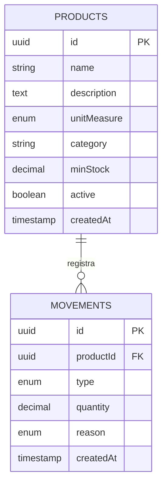

# Diagrama entidad-relación

## Cardinalidad

- Un **producto** tiene cero o muchos **movimientos**.
- Un **movimiento** pertenece a exactamente un **producto**.
- El stock no se almacena: se deriva de la suma de movimientos.

## Notas

- `type = IN` suma `quantity`; `type = OUT` resta.
- Eliminación de producto con historial: solo `active = false`.
